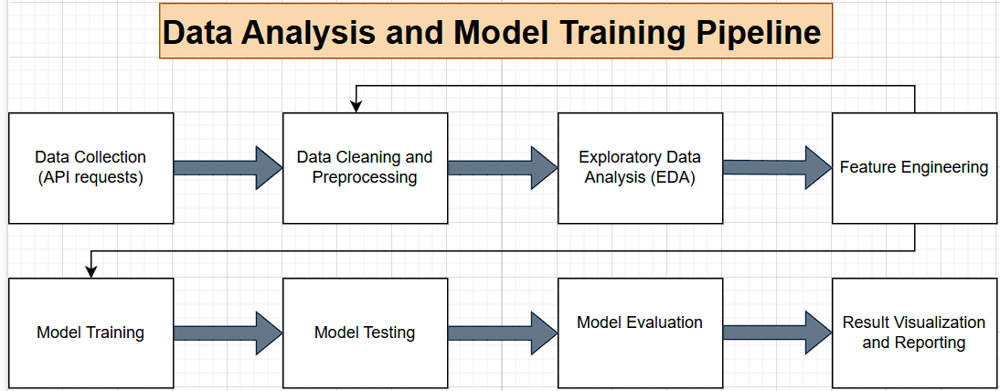
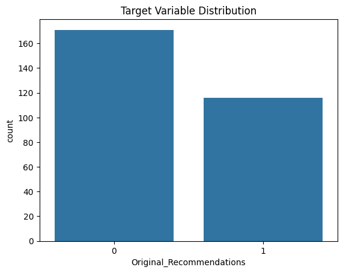
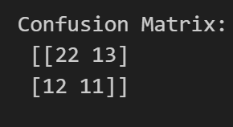
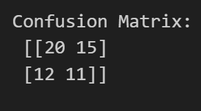
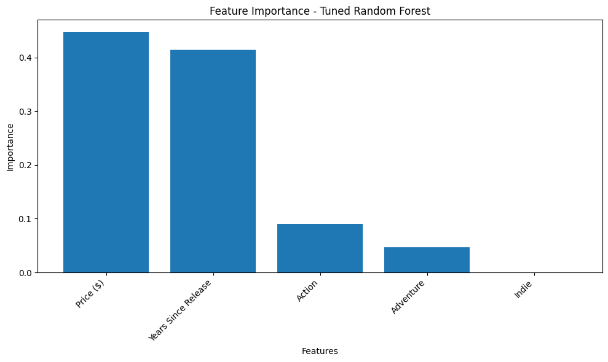
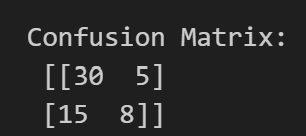
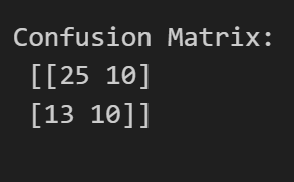
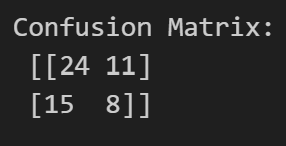
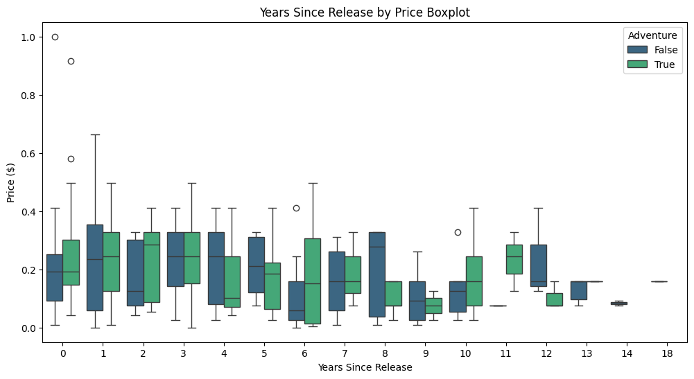

# Predicting Indie Game Success on Steam using Machine Learning

## Abstract
This project investigates the factors contributing to the success of indie games on Steam by leveraging game metadata, player engagement metrics, and machine learning techniques. Through detailed data collection, preprocessing, and exploratory data analysis, we developed predictive models to identify key determinants of game success. A tuned Random Forest model achieved the best accuracy (66%), emphasizing the importance of factors like price and release longevity. This project provides actionable insights for indie developers to optimize their games and strategies for greater market success.

[**Click here to access the full Overleaf Report**](https://www.overleaf.com/read/nkwywqzxpcwr#cf3410)

## Project Overview
Indie games dominate the Steam platform, with thousands released annually. However, developers often face challenges understanding what factors drive success. This capstone project aims to:
- Predict game success based on metadata using machine learning models.
- Provide actionable insights to indie developers.
- Offer players insights into discovering quality titles.

Key deliverables include:
- A professional Overleaf report documenting the project in detail.
- A comprehensive GitHub repository containing datasets, scripts, notebooks, and visualizations.

The pipeline used for this project is illustrated below:



This diagram provides an overview of the data flow, from collection to model evaluation.

## Table of Contents
- [Abstract](#abstract)
- [Project Overview](#project-overview)
- [Table of Contents](#table-of-contents)
- [Project Structure](#project-structure)
- [Installation and Setup](#installation-and-setup)
- [Data Collection](#data-collection)
- [Data Cleaning and Feature Engineering](#data-cleaning-and-feature-engineering)
- [Exploratory Data Analysis (EDA)](#exploratory-data-analysis-eda)
- [Model Training and Evaluation](#model-training-and-evaluation)
- [Results and Discussion](#results-and-discussion)
- [Limitations and Future Work](#limitations-and-future-work)
- [References](#references)
- [Links](#links)

## Project Structure
The repository is structured to reflect a professional and modular workflow:
- **`data/`**: Contains raw and processed datasets:
  - `steam_indie_games_all.csv`
  - `steam_indie_games_cleaned.csv`
  - `steam_indie_games_balanced.csv`
- **`notebooks/`**:
  - **Data Cleaning and EDA Notebook**: Prepares data for modeling and explores feature relationships.
  - **Predictive Analysis Notebook**: Includes training and evaluation for Logistic Regression, Random Forest, and SVM models.
- **`src/`**: Python scripts for API data collection:
  - `steam_data_collection.py`: Implements API rate-handling logic and balancing strategies.
- **`results/`**: Contains output files such as evaluation metrics and visualizations.
- **`images/`**: Contains all figures and screenshots used in the report.
- **README.md**: This documentation file, linking to the report and providing an overview.
- **requirements.txt**: Lists Python dependencies for reproducibility.
- **.gitignore**: Prevents sensitive or unnecessary files from being included in the repository.

## Installation and Setup
To set up this project locally, follow these steps:

1. **Clone the repository**:
```bash
   git clone https://github.com/dgraves4/steam-indie-success
   cd steam-indie-success
```

2. **Create and activate a virtual environment**

```bash
py -m venv .venv
source .venv\Scripts\activate
```

3. Install the required dependencies:

```bash
pip install -r requirements.txt
```

4. Configure API access:

- Obtain an API key from the Steam API.
- Store the key in an environment variable or in a configuration file such as .env (ensure you include it in your .gitignore file to prevent it from being pushed to the repository).

5.  Jupyter Notebook Setup
- If using Jupyter notebooks for running analysis, ensure Jupyter is installed:

```bash
pip install jupyter
jupyter notebook
```

## Data Collection

Data was collected from the [Steam API](https://developer.valvesoftware.com/wiki/Steam_Web_API), which provides extensive game metadata including game details, gameplay features, community engagement metrics, and user reviews. This project focuses on extracting key attributes like game price, release date, genre, developer information, and user recommendation counts to predict the success of indie games on the platform.

The data collection process involved:
- **API Requests**: A Python script (`steam_data_collection.py`) was used to collect data via API calls, including error handling for API rate limits (using retry logic and exponential backoff).
- **Balanced Dataset**: Data was curated to ensure a balanced representation of both popular and lesser-known indie games. The balancing aimed to avoid bias and ensure a fair distribution of recommendations.

For sample data and data processing scripts, refer to the `data/` folder and the `src/` directory.

## Data Cleaning and Feature Engineering

The dataset underwent cleaning and preprocessing to ensure data quality:
- Handled missing values and dropped unreliable columns (e.g., Metacritic Score).
- Engineered features like "Years Since Release" to provide temporal context.
- Log-transformed recommendations to reduce skewness.


*Figure: Correlation heatmap of key features after data cleaning.*

## Exploratory Data Analysis (EDA)
Key visualizations include:
- **Price Distribution**: Shows the prevalence of games priced below $20.
- **Correlation Heatmap**: Reveals relationships between features.
- **Genre Heatmap**: Highlights the dominance of action and adventure games.

EDA revealed insights such as the importance of affordable pricing and the impact of release longevity on success. Visualizations are available in the `images/` folder and the [report](https://www.overleaf.com/read/nkwywqzxpcwr#cf3410).

### Data Attributes

| Column Name        | Description                                          | Data Type | Example Value        |
|--------------------|------------------------------------------------------|-----------|----------------------|
| AppID              | Unique identifier for each game                      | Integer   | 440                  |
| Game Name          | Title of the game                                    | String    | Team Fortress 2      |
| Release Date       | Date when the game was released                      | DateTime  | 2007-10-10           |
| Developer          | Developer(s) of the game                             | String    | Valve                |
| Genres             | Genres associated with the game                      | String    | Action, Free-to-Play |
| Price ($)          | Price of the game in USD                             | Float     | 19.99                |
| Recommendations    | Number of recommendations received (log transformed) | Float     | 10.82                |
| Years Since Release| Years since the game was released                    | Integer   | 17                   |

### Notes on Dataset

- **Data Source**: The dataset consists of indie games from the Steam platform, collected using the Steam Web API. This provides game-specific information, including release dates, developers, genres, and community reception metrics.
- **Feature Engineering**:
  - The "Release Date" column was converted to a `DateTime` data type for easier manipulation during analysis.
  - The "Recommendations" feature underwent a logarithmic transformation to address skewness and reduce the influence of outliers.
  - A new feature, "Years Since Release," was engineered to provide temporal context, aiding in the analysis of how game release longevity impacts success.
- **Data Formats**: The data was saved in two formats:
  - `steam_indie_games_all.csv` (full dataset with multiple cleaning versions,V1, V2, and V3)
  - `steam_indie_games_balanced.csv` (initial, uncleaned, balanced dataset for machine learning models)
- **Balanced Dataset**: The balanced dataset aimed to include a mix of both highly popular and lesser-known games to ensure a more representative analysis for machine learning models.

### Model Training and Evaluation

Models were trained and evaluated using various metrics like accuracy, precision, recall, and F1-score. Below are visualizations highlighting model performance and key metrics:

#### Target Variable Distribution


*Figure: Distribution of the target variable (game success).*

#### Logistic Regression
- Combined Features:


*Figure: Confusion matrix for Logistic Regression (combined features).*

- Years Since Release:


*Figure: Confusion matrix for Logistic Regression (Years Since Release feature).*

#### Random Forest
- Feature Importance:


*Figure: Feature importance scores from the Random Forest model.*

- Combined Features (Tuned):


*Figure: Confusion matrix for Random Forest (tuned, combined features).*

- Combined Features (Untuned):


*Figure: Confusion matrix for Random Forest (untuned, combined features).*

#### Support Vector Machine (SVM)
- Combined Features (Tuned):


*Figure: Confusion matrix for SVM (tuned, combined features).*

### Evaluation Metrics
Models were evaluated using:
- **Accuracy**: To measure the overall correctness of predictions.
- **Precision**: To understand how many of the predicted successes were actually successful.
- **Recall**: To determine the model's ability to identify all successful games.
- **F1-score**: To balance precision and recall, particularly useful given the potential class imbalance issues.

Currently, the Random Forest model with tuned hyperparameters provided the best performance in terms of accuracy. However, due to the inherent class imbalance in the dataset, further adjustments like class weighting or resampling are being considered to improve model reliability.


## Results and Discussion

### Model Performance Summary

| Model                           | Features              | Accuracy | Precision (Class 0) | Recall (Class 0) | Precision (Class 1) | Recall (Class 1) | F1-Score |
|---------------------------------|-----------------------|----------|---------------------|------------------|---------------------|------------------|----------|
| Logistic Regression             | Years Since Release   | 53.40%   | 62%                 | 57%              | 42%                 | 48%              | 52%      |
| Logistic Regression             | Combined Features     | 56.90%   | 65%                 | 63%              | 46%                 | 48%              | 55%      |
| Random Forest (Untuned)         | Years Since Release   | 60.30%   | 62%                 | 86%              | 50%                 | 22%              | 51%      |
| Random Forest (Untuned)         | Combined Features     | 60.30%   | 66%                 | 71%              | 50%                 | 43%              | 58%      |
| Random Forest (Tuned)           | Combined Features     | **65.52%** | 67%                 | 86%              | 62%                 | 35%              | 60%      |
| SVM (Untuned)                   | Years Since Release   | 60.30%   | 63%                 | 83%              | 50%                 | 26%              | 53%      |
| SVM (Untuned)                   | Combined Features     | 50.00%   | 58%                 | 60%              | 36%                 | 35%              | 47%      |
| SVM (Tuned)                     | Combined Features     | 55.17%   | 62%                 | 69%              | 42%                 | 35%              | 51%      |

**Key Observations**:
- **Random Forest** performed the best after tuning, achieving an accuracy of **65.52%**.
- **SVM** struggled with accuracy, even after hyperparameter tuning, indicating it may not be the best model for this dataset.
- **Logistic Regression** also showed moderate performance but was outperformed by Random Forest.




## Limitations and Future Work

### Limitations
Some limitations encountered in this project include:

- **Potential biases in user reviews**: Reviews may not accurately represent the entire player base, as they could be biased by extreme experiences—either highly positive or highly negative. This may impact the reliability of "Recommendations" as a predictor of game success.
- **Class Imbalance**: The dataset had significantly more non-successful games compared to successful ones, which impacted model performance, particularly in accurately identifying successful games. This imbalance was partially addressed through stratified sampling and careful data selection, but it remains a challenge in improving predictive performance for lesser-known, successful indie games.
- **Data constraints for niche games**: Data availability for niche games was limited, which can impact the model's ability to generalize across the entire spectrum of indie games on Steam.
- **Modeling complex user behavior**: Predicting user behavior based on review sentiment and game metadata is inherently complex due to individual player motivations and preferences. The models used in this project may struggle to capture these nuances fully.

### Future Work
Future improvements and extensions for this project could include:

- **Addressing Class Imbalance**: Implementing techniques like Synthetic Minority Over-sampling Technique (SMOTE) or experimenting with different class weights to address class imbalance and improve recall for the "successful" class.
- **Exploring Additional Platforms**: Collecting data from other gaming platforms beyond Steam, such as the Epic Games Store or Microsoft Store, to enhance the generalizability of the model.
- **Advanced Modeling Techniques**: Implementing more sophisticated models, such as deep learning, to capture more nuanced sentiment and complex patterns in user behavior, potentially improving prediction accuracy.
- **Sentiment Analysis of Reviews**: Adding sentiment analysis of user reviews to quantify the qualitative aspects of player feedback. This could be used as an additional feature to help predict game success more accurately.
- **Hyperparameter Tuning Automation**: Exploring automated hyperparameter tuning approaches, such as Bayesian optimization, to reduce the manual effort required for model improvement.
- **Real-time Data Integration**: Integrating real-time data using the Steam API to track ongoing changes in player sentiment and game engagement, which could make the prediction dynamic and timely.

## References

- Breiman, L. (2001). [Random forests](https://doi.org/10.1023/A:1010933404324). *Machine Learning, 45*(1), 5–32.  
- Chawla, N. V., Bowyer, K. W., Hall, L. O., & Kegelmeyer, W. P. (2002). [SMOTE: Synthetic Minority Over-sampling Technique](https://doi.org/10.1613/jair.953). *Journal of Artificial Intelligence Research, 16*, 321–357.  
- Kirasich, K., Smith, T., & Sadler, B. (2018). [Random Forest vs Logistic Regression: Binary Classification for Heterogeneous Datasets](https://scholar.smu.edu/datasciencereview/vol1/iss3/9). *SMU Data Science Review, 1*(3), Article 9. Creative Commons License.  
- Lounela, K. (2024). [On Identifying Relevant Features for a Successful Indie Video Game Release on Steam](https://aaltodoc.aalto.fi/items/d578980e-71fa-4618-b500-dff30bbac490). *Master’s Programme in Department of Information and Service Management*.  


## Links

- [Overleaf Project Report](https://www.overleaf.com/read/nkwywqzxpcwr#cf3410): The detailed project report, including findings, analysis, and visualizations.
- [GitHub Repository](https://github.com/dgraves4/steam-indie-success): The project repository containing all scripts, data, notebooks, and supporting files.
- [Steam Data Collection Script](https://github.com/dgraves4/steam-indie-success/blob/main/src/steam_data_collection.py): Python script used to collect game data from the Steam Web API.
- [Data Cleaning and EDA Notebook](https://github.com/dgraves4/steam-indie-success/blob/main/notebooks/data_cleaning_EDA.ipynb): Notebook detailing the data cleaning and exploratory data analysis process.
- [Predictive Analysis Notebook](https://github.com/dgraves4/steam-indie-success/blob/main/notebooks/predictive_analysis.ipynb): Notebook containing the machine learning models, hyperparameter tuning, and evaluation.
- [Raw Dataset](https://github.com/dgraves4/steam-indie-success/tree/main/data): Directory containing raw and processed datasets used in the project.
- [Steam Web API Documentation](https://developer.valvesoftware.com/wiki/Steam_Web_API): Official documentation for the Steam Web API used to collect game metadata.

